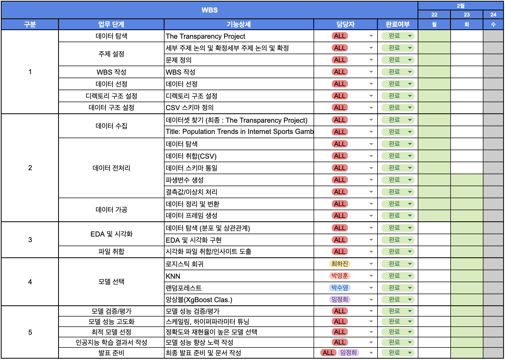
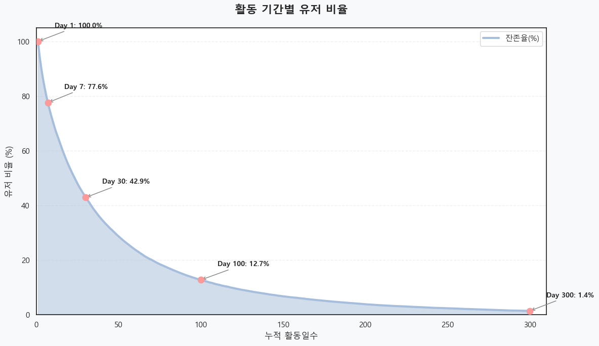

# SKN24-2nd_3TEAM

---

# 📅 프로젝트 기간

- 2026.02.23(월)~2026.02.24(화)

---

# 1. 팀 소개

## 1-1. 팀명
### 🏠종이의 집에서 수영하기 🏊‍♂️ 

## 1-2. 팀원 구성 및 GitHub

| 사진 | 이름 | GitHub |
| --- | --- | --- |
|  | 박수영 | [suyoung6279](https://github.com/suyoung6279) |
|  | 박영훈 | [aprkaos56](https://github.com/aprkaos56) |
|  | 임정희 | [bigmooon](https://github.com/bigmooon) |
|  | 최하진 | [hun6684](https://github.com/hun6684) |

---

# 2. 프로젝트 개요

## 2-1. 프로젝트 소개

본 프로젝트는 약 3만명의 유저와 400만 건 이상의 베팅 로그를 포함한 실측 데이터를 기반으로 스포츠 베팅 플랫폼 `bwin`에서의 고객 행동 패턴과 이탈 간의 상관관계를 분석합니다.
단순 현황 파악이 아닌 EDA와 머신러닝 모델을 활용해 이탈 위험 고객을 사전에 식별하고, 플랫폼 운영 안정성을 높이기 위한 데이터 기반의 선제적 대응 전략을 제시합니다.

## 2-2. 프로젝트 배경


**<글로벌 스포츠 베팅 시장 규모, 점유율 및 트렌드 분석 보고서 – 산업 개요 및 2033년까지의 전망>**

> 출처: [스포츠 베팅 시장의 규모, 트렌드 및 성장 예측 2033](https://www.databridgemarketresearch.com/ko/reports/global-sports-betting-market)

## 2-3. 프로젝트 필요성

### 1) 신규 이용자 초기 이탈 문제

> 데이터 분석 결과, 신규 가입 이용자 중 상당수가 가입 이후 초기 활동 단계에서 빠르게 이탈하는 경향을 보이고 있습니다.
>
> 온라인 베팅 플랫폼은 신규 이용자 확보를 위해 마케팅 및 운영 비용이 투입되는 구조이기 때문에, 초기 이탈은 단순 이용 감소를 넘어 고객 획득 비용 회수 실패로 이어질 수 있습니다. 또한 신규 이용자 기반이 안정적으로 형성되지 않을 경우 플랫폼 매출 구조의 변동성이 확대될 가능성도 존재합니다.

### 2) 일반 온라인 서비스와 다른 도메인 특성

> 스포츠 베팅 플랫폼은 일반 온라인 서비스에 비해 이용 주기가 짧고, 경기 일정·이벤트·결과에 따라 활동 강도가 급격히 변동하는 특성을 가집니다.
이로 인해 사용자별 참여 패턴 변화가 단기간 내 뚜렷하게 나타나며, 이탈 전조 신호 또한 비교적 빠르게 관찰될 수 있습니다.

### 3) 합법 스포츠 베팅 제도의 운영 안정성 확보 필요

> 합법 스포츠 베팅 제도는 불법 사행 시장을 줄이고, 사행 수요를 제도권 내에서 관리하기 위해 운영되고 있습니다.
그러나 합법 플랫폼에 유입된 신규 이용자가 초기에 이탈할 경우, 해당 수요가 다시 비공식 영역으로 이동할 가능성이 존재합니다.
> 특히, 온라인 환경에서는 플랫폼 간 이동이 용이하기 때문에 초기 이탈은 단순 활동 감소를 넘어서 합법 플랫폼의 이용자 기반 약화로 이어질 수 있습니다.


> 출처: [관점이 있는 뉴스 프레미안](https://www.pressian.com/pages/articles/21257)


### 4) 사후 대응보다 사전 예측 중심 분석 필요

> 실제 운영에서는 고객이 이미 이탈한 뒤 성과 지표를 통해 확인하는 경우가 많습니다. 그러나 이 경우 대응 시점이 늦어질 수 있으며, 이탈 원인 분석도 제한적일 수 있습니다.
따라서 본 프로젝트는 머신러닝 기반 분류 모델을 활용하여 이탈 가능성을 사전에 탐지하고, 주요 영향 요인을 도출하는 예측 중심 접근의 가능성을 검토하고자 합니다.

## 2-5. 프로젝트 목표

### 1) 고객 이탈 기준 정의 및 타깃 변수 설계

- 인터넷 베팅 플랫폼 데이터 특성에 맞게 **고객 이탈(Churn) 기준**을 정의하고,
- 머신러닝 분류 문제에 적합한 타깃 변수(y)를 설계합니다.

### 2) 데이터 전처리 및 피처 엔지니어링

- 결측치/이상치 처리 및 데이터 정제를 수행하고,
- 적중률, 수익률 등 파생 변수를 생성하여 모델 입력 데이터를 구성합니다.

### 3) 머신러닝 기반 이탈 예측 모델 구축 및 성능 비교

- Logistic Regression, Random Forest, XGBoost 등의 분류 모델을 구축하고,
- Precision, Recall, F1-score, ROC-AUC 등 지표를 기반으로 모델 성능을 비교 평가합니다.

### 4) 이탈 영향 요인 분석 및 해석

- Feature Importance 및 모델 해석 결과를 바탕으로 인터넷 베팅 플랫폼 고객 이탈에 영향을 미치는 주요 행동 요인을 도출합니다.

### 5) 운영 관점 시사점 도출

- 예측 결과를 통해 고객 이탈 조기 탐지 가능성을 검토하고, 서비스 운영 및 고객 경험 개선 관점에서 활용 가능한 인사이트를 제시합니다.

---

# 3. 기술 스택

### Language


### Data Analysis


### Visualization


### Machine Learning

    

| Language | Python |
| --- | --- |
| Data Processing | pandas, numpy |
| Data Visualization | matplotlib, seaborn |
| Machine Learning | scikit-learn |

---

# 4. WBS 및 폴더 구조




# Project Structure

```
04_ml_projects/
├── .github/
│   └── pull_request_template.md
├── .gitignore
├── assets/
│   └── *.png
├── data/
│   ├── processed/
│   │   └── ljh_preprocessed.csv
│   └── raw/
│       ├── sports_gb_F.csv
│       ├── sports_gb_L.csv
│       └── sports_gb_total.csv
├── docs/
│   ├── ai_training_report_template.md
│   ├── git_strategy.md
│   └── model_manager.md
├── models/
│   ├── knn_churn_v1/
│   │   └── report_pyh_knn.md
│   └── xgb/
│       ├── reports_ljh_xgboost.md
│       ├── xgb_meta.json
│       └── xgb.joblib
├── notebooks/
│   ├── chj/
│   │   └── 03_modeling.ipynb
│   ├── ljh/
│   │   ├── 01_preprocessing.ipynb
│   │   ├── 02_EDA.ipynb
│   │   └── 03_modeling.ipynb
│   ├── psy/
│   │   ├── 01_preprocessing.ipynb
│   │   ├── 02_EDA.ipynb
│   │   ├── 02_EDA_refine.ipynb
│   │   ├── 03_Modeling1.ipynb
│   │   ├── psy_RF_Churn_v1.joblib
│   │   ├── psy_RF_Churn_v1_meta.json
│   │   └── sports_gb_total_final.csv
│   └── pyh/
│       └── 03_modeling.ipynb
├── src/
│   └── utils/
│       ├── __init__.py
│       ├── model_manager.py
│       └── plot_config.py
├── main.ipynb
├── README.md
└── requirements.txt
```

## 디렉토리 설명

| 디렉토리          | 설명                                       |
| ----------------- | ------------------------------------------ |
| `assets/`         | README에 사용되는 이미지 파일              |
| `data/raw/`       | 원본 데이터 (수정 금지)                    |
| `data/processed/` | 전처리 완료된 데이터                       |
| `docs/`           | 프로젝트 가이드 및 문서                    |
| `models/`         | 학습 완료된 모델 파일 및 보고서            |
| `notebooks/`      | 팀원별 분석 노트북 (chj / ljh / psy / pyh) |
| `src/utils/`      | 공용 유틸리티 모듈                         |

---

# 5. 데이터 수집 및 출처

## 5-1. 인터넷 베팅 사이트 데이터

- 출처: [The Transparency Project - Data Download](http://www.thetransparencyproject.org/download_index.php)
- 설명: 2005년 2월 1일부터 2006년 8월 31일까지의 온라인 스포츠 베팅 기록

## 5-2. 고객 이탈 선정 기준

- 출처: [Help - General Information - Does bwin charge inactivity fees? (UK)](https://help.bwin.com/en/general-information/account/inactive)
- 설명: 13개월 연속으로 베팅을 하지 않으면 '비활성'으로 분류

---

# 6. 데이터 전처리 및 통합

## 원본 데이터


## 원본 데이터 컬럼
```
# 0. UserID : 각 유저별 고유 인덱스. 식별자 컬럼이므로 모델링 시 제외 검토
# 1. CountryID : 국가 코드. 범주형 변수로 사용
# 2. Gender : 성별 코드. 범주형 변수로 사용
# 3. BirthYear : 출생연도. 결측치(2개) 처리 후 int 변환, age/age_group 파생에 사용
# 4. DateReg : 가입일(str). datetime 변환용
# 5. TimeReg : 가입시간(str)
# 6. Date1Dep : 첫 입금일(str)
# 7. Date1Bet : 첫 베팅일(str), 스포츠 이외에도 다른 변수 포함
# 8. Date1Spo : 첫 스포츠 베팅일(str)
# 9. StakeF : 경기 전(F) 베팅금액. 수치형
# 10. StakeL : 경기 중(L) 베팅금액. 수치형
# 11. StakeA : 전체(A) 베팅금액. 수치형
# 12. WinF : 경기 전(F) 베팅 당첨금액. 수치형
# 13. WinL : 경기 중(L) 당첨금액. 수치형
# 14. WinA : 전체(A) 당첨/수익금액. 수치형
# 15. BetsF : 경기 전(F) 베팅 건수. count형
# 16. BetsL : 경기 중(L) 베팅 건수. count형
# 17. BetsA : 전체(A) 베팅 건수. count형
# 18. DaysF : 경기 전(F) 활동일수. count형
# 19. DaysL : 경기 중(L) 활동일수. count형
# 20. DaysA : 전체(A) 활동일수. count형
```
## 6-1. age_group 그룹화
기준년도: 2006년
10대:0 / 20대:1 / 30대:2 / 40대:3 / 50대:4 / 60대:5 / 70대:6 / 80대:7 / 90대이상:8


## 6-2. hit_days 계산
`hit_days = ` **적중일수 파생 변수**
- **Fixed/Live**: 각 유형별 독립 계산
- **Total**: F + L 일별 합산 후 판정
  


## 6-3. win_rate 계산

`win_rate = (Win > Stake) / (Bets > 0)` **승률 파생 변수**
- **Fixed/Live**: 각 유형별 독립 계산
- **Total**: F + L 일별 합산 후 판정


## 6-4. avg_roi 계산

`avg_roi = mean((Win - Stake) / Stake)` where `Bets > 0 && Stake > 0` **평균 ROI 파생 변수**
- 일별 ROI를 먼저 계산한 뒤 유저별 평균 → 베팅 빈도 관계없이 하루하루의 수익률을 동등하게 반영
- **Total**: `_fl_w`(win_rate에서 생성, F + L 일별 합산) 재사용


## 6-5. churn 계산 (고객 이탈)
기준일: 데이터 마지막 날짜 `2006-08-31`
- `0`: 기준일로부터 13개월(395일) 이내 베팅 활동 있음
- `1`: 없음


### 이탈률을 13개월로 설정한 근거


> 출처: [Bwin 공식 사이트 도움말 답변](https://help.bwin.com/en/general-information/account/inactive)

## 통합 데이터


## 통합 데이터 컬럼

```
# 0. user_id : 각 유저별 고유 인덱스. 식별자 컬럼이므로 모델링 시 제외 검토
# 1. country_id : 국가 코드. 범주형 변수로 사용
# 2. gender : 성별 코드. 범주형 변수로 사용
# 3. age_group : 출생연도(BirthYear) 기반 연령대 파생 변수. 범주형 변수로 사용
# 4. reg_date : 가입일 전처리 컬럼(str). DateReg/TimeReg 기반으로 정리한 가입일 정보
# 5. first_deposit : 첫 입금일 전처리 컬럼(str). Date1Dep 기반
# 6. first_bet : 첫 베팅일 전처리 컬럼(str). Date1Bet 또는 Date1Spo 기준으로 정리한 컬럼
# 7. fixed_bet_amount : 경기 전(F) 베팅금액. 수치형
# 8. live_bet_amount : 경기 중(L) 베팅금액. 수치형
# 9. total_bet_amount : 전체(T) 베팅금액. 수치형
# 10. fixed_win_amount : 경기 전(F) 베팅 당첨금액. 수치형
# 11. live_win_amount : 경기 중(L) 베팅 당첨금액. 수치형
# 12. total_win_amount : 전체(T) 베팅 당첨/수익금액. 수치형
# 13. fixed_bet_cnt : 경기 전(F) 베팅 건수. count형
# 14. live_bet_cnt : 경기 중(L) 베팅 건수. count형
# 15. total_bet_cnt : 전체(T) 베팅 건수. count형
# 16. fixed_active_days : 경기 전(F) 활동일수. count형
# 17. live_active_days : 경기 중(L) 활동일수. count형
# 18. total_active_days : 전체(T) 활동일수. count형
# 19. fixed_hit_days : 경기 전(F) 적중일수 파생 변수. count형 (활동 없음/분모 없음 구간 결측 가능)
# 20. live_hit_days : 경기 중(L) 적중일수 파생 변수. count형 (결측치 다수 존재)
# 21. total_hit_days : 전체(A) 적중일수 파생 변수. count형 (결측치 다수 존재)
# 22. fixed_win_rate : 경기 전(F) 승률/적중률 파생 변수. 수치형 (분모 0 구간 결측 처리)
# 23. live_win_rate : 경기 중(L) 승률/적중률 파생 변수. 수치형 (분모 0 구간 결측 처리)
# 24. total_win_rate : 전체(T) 승률/적중률 파생 변수. 수치형 (분모 0 구간 결측 처리)
# 25. fixed_avg_roi : 경기 전(F) 평균 ROI 파생 변수. 수치형 (분모 0 구간 결측 처리)
# 26. live_avg_roi : 경기 중(L) 평균 ROI 파생 변수. 수치형 (분모 0 구간 결측 처리)
# 27. total_avg_roi : 전체(T) 평균 ROI 파생 변수. 수치형 (분모 0 구간 결측 처리)
# 28. churn : 이탈 여부 타겟 변수(0/1). 모델 학습용 타겟 컬럼
```
---

# 7. EDA 시각화 및 분석 인사이트


- 이탈 여부는 위 데이터셋의 회사인 스포츠 베팅 회사 Bwin의 휴먼 전환 일자를 기준으로 1년 1개월, 395일로 잡았음
    - 출처 | "https://help.bwin.com/en/general-information/account/inactive"

- 관측기간인 2005 ~ 2006.08.31 기간 내에 활동이 존재하는 회원 중, 마지막 날짜를 기준으로 더이상 활동하지 않는 회원은 약 30% 이상이었음


- total_active_days (-0.35)와 fixed_active_days (-0.34)가 가장 강한 음의 상관관계를 보이고 있음
- 수익률(ROI)은 이탈과 상관관계가 거의 없음(-0.01)


잔존 유저의 중앙값은 약 35일 근처인 반면, 이탈 유저는 10일 미만에 매우 낮게 형성되어 있음

- **이는 대부분의 이탈자가 활동 초기에 서비스를 떠났음을 의미함**

이탈자의 대부분은 적은 금액의 베팅 규모와 베팅 건수를 가지고 있음

- **이는 일회성 베팅의 의미가 강하다는 것을 의미함**

수익률 및 승률은 잔존 유저와 큰 차이가 없는 것으로 나타남
- **이는 이는 고객이 돈을 잃어서 떠나기보다, 서비스를 지속하는 것에 대한 흥미나 동기부여가 부족해서 떠난다는 것을 예측해볼 수 있음**흥미나 동기부여가 부족해서 떠난다는 것을 예측해볼 수 있음




활동 일수를 보면, **누적 활동 7일 이내에 약 22%**의 유저가 이탈하며, 누적 활동 30일 시점에는 유저의 절반 이상(57.1%)이 이탈함

- **초반 1~7일(누적 활동 기준) 안에 유저에게 확실한 서비스와 동기를 줘야하는 것을 시사함**


여러 유형의 베팅을 하는 유저가 가장 낮은 이탈률(19.5%)을 기록함

- **이는 다양한 서비스가 고객의 이탈을 막는 것으로 볼 수 있음**

## 인사이트

# 분석 결과 요약
데이터 분석 결과, 고객의 이탈은 단순한 금전적 손실(ROI)보다는 **초기 활동의 연속성**과 **서비스 경험의 다양성 부재**에서 나온다는 것을 확인

---

# 핵심 인사이트

* **이탈 유저의 성향 : 일회성 베팅 성향**
    * 이탈 유저의 베팅 규모와 건수는 잔존 유저 대비 현저히 낮으며, 누적 활동 중앙값이 10일 미만인 점을 고려할 때 일회성이 강하다는 것을 보여줌
    * 수익률(ROI) 및 승률 지표는 잔존 유저와 유의미한 차이를 보이지 않았으며(상관계수 -0.01), 이는 고객이 경제적 손실 때문이 아니라 서비스 지속에 대한 흥미나 동기부여 부족으로 인해 이탈함을 시사함

* **초기 30일의 중요성**
    * 누적 활동 7일 이내에 유저의 22.4%, 30일 시점에는 57.1%가 이탈함, 활동 초기에 이탈을 확인할 수 있음
    * 이는 가입 초기 1주일 이내에 유저에게 강력한 서비스 경험과 접속 동기를 제공하여 **'누적 활동 30일'** 만드는 것이 중요하다는 것을 의미함

* **서비스 다양성의 필요성**
    * 베팅 유형별 분석 결과, Fixed Only 유형(이탈률 43.0%)보다 Fixed와 Live를 병행하는 **Mixed 유형의 이탈률(19.5%)이 2.2배 이상 낮게** 나타났음
    * 이는 다양한 서비스를 이용하는 고객일수록 이탈하지 않을 가능성이 높다는 것을 증명함

---


---

# 8. 💭 한 줄 회고
### - 박수영:
>

### - 박영훈:
> ㅇㅇㅇㅇ

### - 임정희:
>

### - 최하진:
> 
